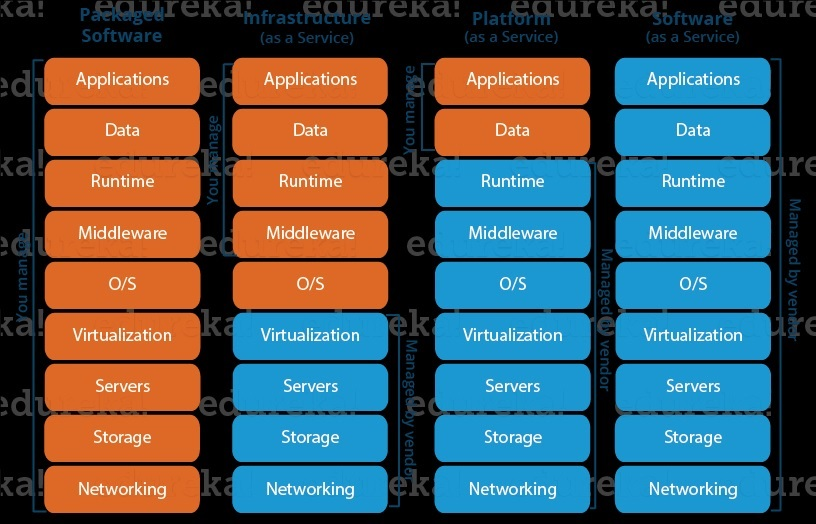
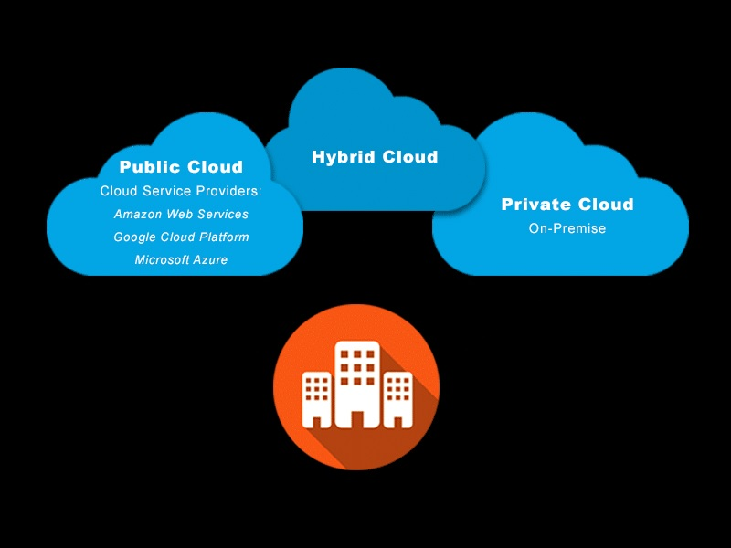
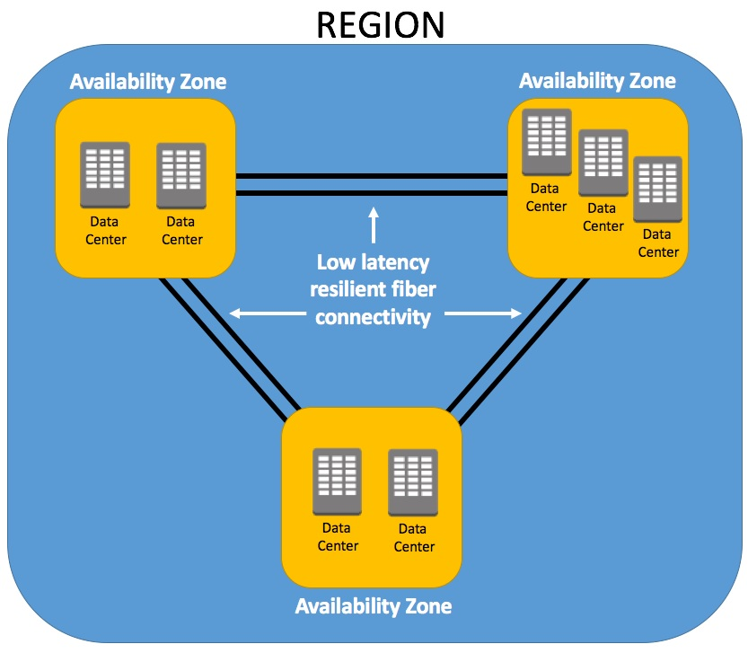

# AWS-Learning

Cloud computing is the on-demand delivery of IT resources over the Internet with pay-as-you-go pricing. Instead of buying, owning, and maintaining physical data centers and servers, you can access technology services, such as computing power, storage, databases,and Networking on an as-needed basis from a cloud provider like Amazon Web Services (AWS).

## Cloud service models

### Infrastructure as a Service (IaaS):

In the IaaS model, AWS provides virtualized computing resources over the internet. It offers a high level of flexibility and control to users, who are responsible for managing and maintaining the underlying infrastructure. With IaaS, you can provision and manage virtual machines, storage, networks, and other fundamental computing resources. AWS services like Amazon EC2 (Elastic Compute Cloud) and Amazon S3 (Simple Storage Service) fall under the IaaS category.

### Platform as a Service (PaaS):

PaaS is a cloud service model where AWS provides a platform and environment for developing, running, and managing applications without worrying about the underlying infrastructure. With PaaS, developers can focus on application development and deployment, while AWS handles the underlying infrastructure, including servers, storage, and networking. AWS Elastic Beanstalk and AWS Lambda are examples of PaaS offerings that simplify application deployment and serverless computing, respectively.

### Software as a Service (SaaS):

SaaS is a cloud service model where AWS delivers software applications over the internet, accessible through a web browser or APIs. In the SaaS model, users can utilize applications hosted on AWS infrastructure without the need for installation, maintenance, or management. Common examples of SaaS offerings by AWS include Amazon WorkMail (email and calendaring), Amazon Chime (online meetings and video conferencing), and Amazon QuickSight (business intelligence and analytics).

## Cloud Deployment Models

### Public Cloud:

Public cloud deployment is the most common and widely used model in AWS. In this model, the cloud infrastructure and services are owned and operated by AWS, and multiple customers share the same underlying hardware, storage, and network devices. Customers access and utilize the resources over the internet, paying for the services they consume. AWS offers a wide range of services, including compute, storage, databases, networking, analytics, machine learning, and more, in the public cloud.

### Private Cloud:

Private cloud deployment is dedicated to a single organization and provides a more controlled and isolated environment. In this model, the organization can either set up their own on-premises private cloud using AWS Outposts, which brings AWS infrastructure and services to the customer's data center, or they can use the virtual private cloud (VPC) service within the AWS public cloud. With a private cloud, organizations have more control over security, compliance, and customization, making it suitable for applications that have strict regulatory requirements or need to handle sensitive data.

### Hybrid Cloud:

Hybrid cloud deployment combines both public and private cloud environments, allowing organizations to leverage the benefits of both models. In a hybrid cloud setup, organizations can run some workloads and applications in the public cloud while keeping others in their private infrastructure or on-premises data centers. AWS provides services and tools to connect, manage, and integrate public and private cloud resources seamlessly. This model offers flexibility, scalability, and cost optimization by enabling organizations to take advantage of the public cloud while maintaining control over certain data or applications.

## Regions

